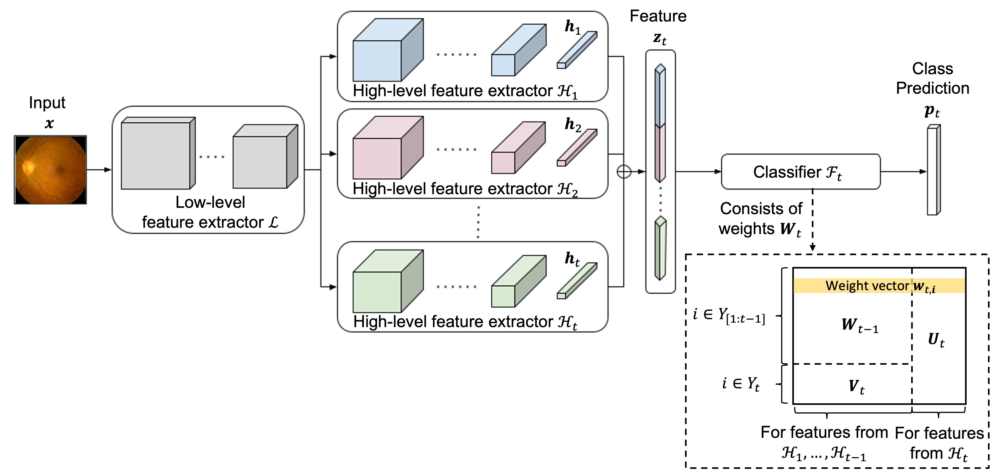

# Leveraging Old Knowledge to Continually Learn New Classes in Medical Images

This repository is the official implementation of Leveraging Old Knowledge to Continually Learn New Classes in Medical Images. 




## Requirements

This implementation has been tested on Python 3.8, Ubuntu 20.04, CUDA 11.4. 

To install package requirements:

```setup
pip install -r requirements.txt
```

To prepare datasets, please refer to the respective folders for instructions:
- CCH5000: [data/colorectal](data/colorectal)
- HAM10000: [data/ham10000](data/ham10000)
- EyePACS: [data/diabetic](data/diabetic)


## Training

For implementation details of our proposed method, please refer to [inclearn/models/der.py](inclearn/models/der.py). It is a generalized framework which uses dynamically expandable representations.

To run experiments on CCH5000 with three different class orders and the protocol of 1 classes per step using our approach:

```bash
python3 -minclearn --options options/der/derE3_colorectal.yaml options/data/colorectal_3orders.yaml \
    --initial-increment 4 --increment 1 --fixed-memory --workers 4 --batch-size 32 \
    --device <gpu_id> --label derE3_colorectal_4steps1 \
    --data-path data/colorectal
```

Likewise, for HAM10000 with three different class orders and the protocol of 1 class per step:

```bash
python3 -minclearn --options options/der/derE3_ham10000.yaml options/data/ham10000_3orders.yaml \
    --initial-increment 3 --increment 1 --fixed-memory --workers 4 --batch-size 32 \
    --device <gpu_id> --label derE0_ham10000_3steps1 \
    --data-path data/ham10000
```

And, for EyePACS:

```bash
python3 -minclearn --options options/der/derE3_diabetic.yaml options/data/diabetic_3orders.yaml \
    --initial-increment 3 --increment 1 --fixed-memory --workers 4 --batch-size 128 \
    --device <gpu_id> --label derE3_diabetic_3steps1 \
    --data-path data/diabetic
```

To conduct experiments using the baseline methods, you just need to replace the first argument of `--options` with the path to the corresponding hyperparameter file, which can be found under the folder [options](options).

By default, no checkpoints will be saved. To save them after training of each task, add the argument `--save-model task`.


## Results

Your training and evaluation results can be found under the folder [results/dev](results), including the summary of the tasks in each run.

For reproduction of the results without training from scratch, we included the outputs from our training under the folder [results/pretrain](results/pretrain). To generate the images and results found in the paper, follow the steps under the notebook `metric.ipynb` and `gradcam.ipynb`. 

Below shows a summary of our model performance:

| Dataset          | New classes per step | Average incremental accuracy |
| :--------------- | :------------------: | :--------------------------: |
| CCH5000          |          1           |            94.5              |
| CCH5000          |          2           |            94.6              |
| HAM10000         |          1           |            78.1              |
| HAM10000         |          2           |            82.0              |
| EyePACS          |          1           |            81.9              |


## Acknowledgement

Thanks for the great code base by [Arthur Douillard](https://github.com/arthurdouillard/incremental_learning.pytorch) and [Shipeng Yan](https://github.com/Rhyssiyan/DER-ClassIL.pytorch).

